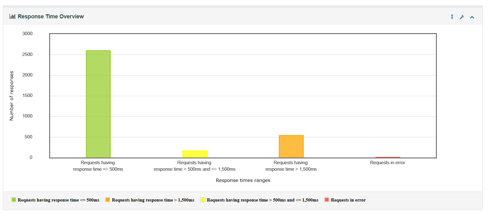

# Jmeter Restful-Booker_Performance-Testing   

  
  
  

---

## 📌 Project Overview  
This project demonstrates **Performance Testing** on the **Restful Booker API** using **Apache JMeter**.  
The goal was to analyze API performance under load, validate response times, error rates, and throughput.  

---

## ⚙️ Tools & Technology  
- 🛠 **Apache JMeter 5.x**  
- 🌐 **Restful Booker API** (public API for testing)  
- 📊 **JMeter Dashboard Report (HTML + CSV)**  
- 🐙 **GitHub** (Version Control & Hosting)  

---

## 🧪 Test Scenarios  
The following endpoints were tested:  
- 🔑 **Auth** → Generate Token  
- ➕ **Create Booking** → `POST /booking`  
- 📖 **Get Booking** → `GET /booking/{id}`  
- ✏️ **Update Booking (PUT/PATCH)** → Update existing booking  
- ❌ **Delete Booking** → Remove a booking  

---

## 📊 Results Summary  

### ✅ Requests Summary  
- **Total Samples:** `3300`  
- **Total Failures:** `8`  
- **Error %:** `0.24%`  
- **Pass Rate:** `99.76%`  

---

### 📈 Statistics Table  
| Request Type              | Samples | Avg Response (ms) | Min (ms) | Max (ms) | Error % | Throughput (req/sec) |
|---------------------------|---------|------------------|----------|----------|---------|-----------------------|
| Auth                      | 550     | 4091.34          | 1398     | 159623   | 0.36%   | 3.39                  |
| Create Booking            | 550     | 388.87           | 323      | 1509     | 0.00%   | 3.40                  |
| Delete Booking            | 550     | 386.46           | 324      | 1451     | 0.36%   | 3.40                  |
| Get Booking               | 550     | 380.64           | 323      | 543      | 0.00%   | 3.40                  |
| Update Booking (PATCH)    | 550     | 389.55           | 325      | 595      | 0.36%   | 3.40                  |
| Update Booking (PUT)      | 550     | 390.11           | 325      | 611      | 0.36%   | 3.40                  |

---

### 🔎 APDEX Score (Application Performance Index)  
- **Overall APDEX:** `0.811` (Acceptable Performance)  
- **Best Performing Endpoint:** `Get Booking` → APDEX `0.984`  
- **Lowest Performing Endpoint:** `Auth` → APDEX `0.012`  

---

## 📂 Project Structure  
## What is performance testing?
Is a non-functional testing approach to ensure that the application and the isolated elements of it will perform well under expected workload.
## What is JMeter?
JMeter is an open-source Java-based tool primarily used for performance testing web applications. 

## Introduction

This document explains how to run a performance test with JMeter against a Booking Site.

## Install

**Java**  
https://www.oracle.com/java/technologies/downloads/

**JMeter**  
https://jmeter.apache.org/download_jmeter.cgi  

Click =>Binaries    
=>**apache-jmeter-5.6.2.zip**

## Prerequisites

- As of JMeter 4.0, Java 8 and above are supported.
- we suggest  multicore cpu's with 4 or more cores.
- Memory 16GB RAM is a good value.

## Elements of a minimal test plan

- Thread Group

    The root element of every test plan. Simulates the (concurrent) users and then run all requests. Each thread simulates a single user.
- HTTP Request Default (Configuration Element)
- HTTP Request (Sampler)
- Summary Report (Listener)

## Creating a Test Plan

The first step in using JMeter is to create a Test Plan. A Test Plan is a collection of elements that define the test scenarios and their configurations. To create a Test Plan, you need to follow these steps:


1. Right-click on the Test Plan in the tree view on the left-hand side of the JMeter interface.
2. Select Add > Threads (Users) > Thread Group.
3. In the Thread Group panel, you can set the number of threads (users) to simulate, the ramp-up period, and the loop count.
4. Next, you need to add a Sampler element to the Thread Group. A Sampler is used to simulate a request to the server under test. To add a Sampler, right-click on the Thread Group, select Add > Sampler, and then choose the appropriate Sampler type (e.g., HTTP Request, JDBC Request, etc.)


5. In the Sampler panel, you can configure the parameters of the request (e.g., URL, method, parameters, etc.)


6. Finally, you can add a Listener element to the Thread Group to view the test results. A Listener displays the test results in various formats such as tables, graphs, and charts. To add a Listener, right-click on the Thread Group, select Add > Listener, and then choose the appropriate Listener type (e.g., Summary Report, Graph Results, etc.).


## Running The Test

Once you have created the Test Plan, you can run the test by clicking on the green arrow in the toolbar. JMeter will start sending requests to the server under test, and you can view the test results in the Listener.

Try Now
In this tutorial, we’ll go over how to set up a basic load test using JMeter to test the [https://restful-booker.herokuapp.com/booking](https://restful-booker.herokuapp.com/booking) API.
Set up the restful-booker.herokuapp.com/booking key by signing up to the above website. Then provide the API request details to the JMeter test plan.


After running the load test, you can view the responses and check the number of requests as well.


I have adjusted the thread group to have 1, 100, 500, 1000, 2000 concurrent users and do a load test.


- Name: Users
- Number of Threads (users): 1, 100, 500, 550.
- Ramp-Up Period (in seconds): 10
- Loop Count: 1  

  1) The general setting for the tests execution, such as whether Thread Groups will run simultaneously or sequentially, is specified in the item called Test Plan.

  2) All HTTP Requests will use some default settings from the HTTP Request, such as the Server IP, Port Number, and Content-Encoding.

  3) Each Thread Group specifies how the HTTP Requests should be carried out. To determine how many concurrent "users" will be simulated, one must first know the number of threads. The number of actions each "user" will perform is determined by the loop count.

  4) The HTTP Header Manager, which allows you to provide the Request Headers that will be utilized by the upcoming HTTP Requests, is the first item in Thread Groups.
  5) 

- Check Different Types of Report.

    Summary and Aggregate  Report for  **Number of Threads 550; Ramp-Up Period 10s**
   
    Aggregate  Report           |  Summary  Report
    :-------------------------:|:-------------------------:
      | 

## Test execution from the Terminal
 
- JMeter should be initialized in non-GUI mode.
- Make a report folder in the **bin** folder.  
- Run Command in __jmeter\bin__ folder.    
 
   - **n**: non GUI mode
  - **t**: test plan to execute
  - **l**: output file with results   


## Make jtl file

```bash
  jmeter -n -t Restful_Booker.jmx -l Report\Restful_Booker.jtl
```    

## Make html file   
  
  ```bash
 jmeter -g Report\Restful_Booker.jtl -o Report\Restful_Booker.html
```

- **g**: jtl results file

- **o**: path to output folder

## HTML Report

### **Number of Threads 550 ; Ramp-Up Period: 10s**


### Response Time Overview **Number of Threads 550 ; Ramp-Up Period 10s**




